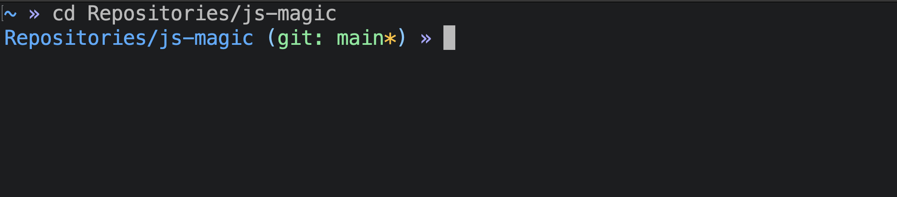

# js-magic
Simplified take on the amazing [af-magic](https://github.com/andyfleming/oh-my-zsh/blob/master/themes/af-magic.zsh-theme) zsh-theme.



## Installation
1. Clone the repository
   ```
   git clone https://github.com/JSextonn/js-magic.git
   ```g
2. Create a symlink of **js-magic.zsh-theme** in `~/.oh-my-zsh/custom/themes/` manually or by using the installer.
   ```
   ./install_js_magic.sh
   ```
3. Configure the theme in your `~/.zshrc` file
   ```
   ZSH_THEME="js-magic"
   ```